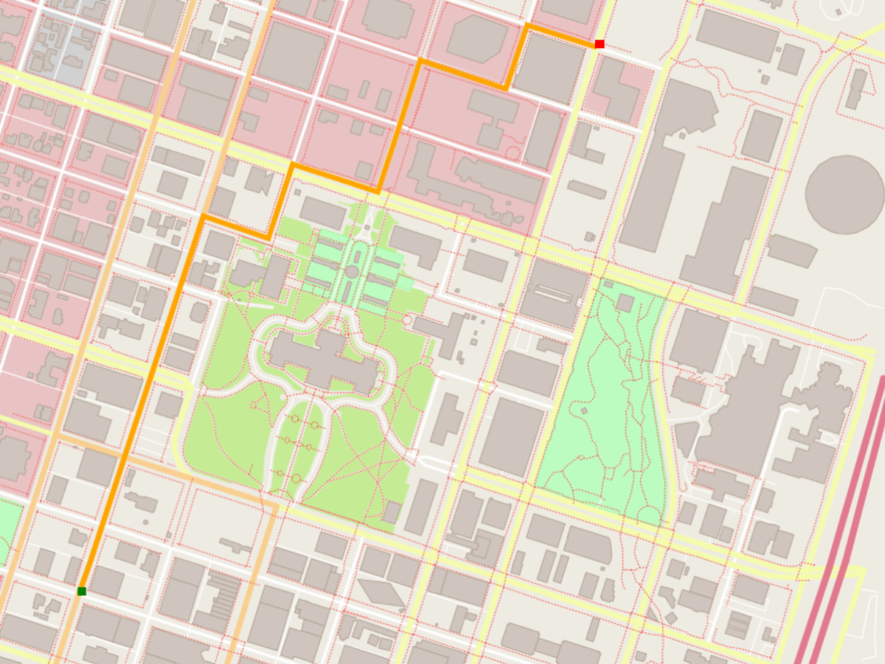

# The Project

The aim of project is to successfully find the shortest path between two points on the map.
This project implements a A* route planner running on OpenStreetMap in C++, similar to what is used on professional router planners like Google Maps.

It can calculate and draw the shortest path from point a to point b. The user enters two coordinates with x and y between 0 and 100, then the map is drawn using the io2d library and the shortest path is rendered in orange:

The steps of this project are the following:

1.  Parsing the data from OpenStreetMap file (.OSM xml file).


2.  The user inputs two points on the map and starting and ending nodes (values in percentage bw(0-100) and coordinate type(x,y) for both).


3.  A* search Alogrithm was used for node searching and path planning.


4.  The path is returned and plotted used IO2D library.


5.  Map data from OSM XML file is parsed and the optimal path is plotted using IO2D Library in C++.


6.  Used GoogleTest Framework for unit testing.


 


## Cloning

When cloning this project, be sure to use the `--recurse-submodules` flag. Using HTTPS:
```
git clone https://github.com/udacity/CppND-Route-Planning-Project.git --recurse-submodules
```
or with SSH:
```
git clone git@github.com:udacity/CppND-Route-Planning-Project.git --recurse-submodules
```

## Dependencies for Running Locally
* cmake >= 3.11.3
  * All OSes: [click here for installation instructions](https://cmake.org/install/)
* make >= 4.1 (Linux, Mac), 3.81 (Windows)
  * Linux: make is installed by default on most Linux distros
  * Mac: [install Xcode command line tools to get make](https://developer.apple.com/xcode/features/)
  * Windows: [Click here for installation instructions](http://gnuwin32.sourceforge.net/packages/make.htm)
* gcc/g++ >= 7.4.0
  * Linux: gcc / g++ is installed by default on most Linux distros
  * Mac: same instructions as make - [install Xcode command line tools](https://developer.apple.com/xcode/features/)
  * Windows: recommend using [MinGW](http://www.mingw.org/)
* IO2D
  * Installation instructions for all operating systems can be found [here](https://github.com/cpp-io2d/P0267_RefImpl/blob/master/BUILDING.md)
  * This library must be built in a place where CMake `find_package` will be able to find it

## Compiling and Running

### Compiling
To compile the project, first, create a `build` directory and change to that directory:
```
mkdir build && cd build
```
From within the `build` directory, then run `cmake` and `make` as follows:
```
cmake ..
make
```
### Running
The executable will be placed in the `build` directory. From within `build`, you can run the project as follows:
```
./OSM_A_star_search
```
Or to specify a map file:
```
./OSM_A_star_search -f ../<your_osm_file.osm>
```

## Testing

The testing executable is also placed in the `build` directory. From within `build`, you can run the unit tests as follows:
```
./test
```

## A* Search Implementation


.png)


